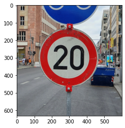

# Traffic Sign Recognition Program

In this project of the Udacity [Self-Driving Car NanoDegree](https://www.udacity.com/course/self-driving-car-engineer-nanodegree--nd013) program, I am implementing a Convolutional Neural Network (CNN) using [TensorFlow](https://www.tensorflow.org/) to classify traffic sign images using the [German Traffic Sign Dataset](http://benchmark.ini.rub.de/?section=gtsrb&subsection=dataset).

**Build a Traffic Sign Recognition Project**

The goals / steps of this project are the following:
* Load the data set (see below for links to the project data set)
* Explore, summarize and visualize the data set
* Design, train and test a model architecture
* Use the model to make predictions on new images
* Analyze the softmax probabilities of the new images
* Summarize the results with a written report

## Resources

* [Self-Driving Car NanoDegree](https://www.udacity.com/course/self-driving-car-engineer-nanodegree--nd013) course description at Udacity.
* [Traffic Sign Classifier](https://github.com/udacity/CarND-Traffic-Sign-Classifier-Project) project template on Github.
* [German Traffic Sign Dataset](http://benchmark.ini.rub.de/?section=gtsrb&subsection=dataset)

## Summary

### Data Set Summary & Exploration

I used NumPy as well as some Pandas functionality to inspect the structure of the traffic sign image dataset. In cell 5 of the [Jupyter notebook](P3.ipynb), the following basic statistics are calculated:

* The size of training set is *34799*.
* The size of the validation set is *4410*.
* The size of test set is *12630*.
* The shape of a traffic sign image is *32x32x3* pixels in RGB.
* The number of unique classes/labels in the data set is *43*.

Using the provided [label map](signnames.csv) an overview of all available image classes is generated, with the title of each subplot showing the class label, corresponding title and number of samples in the combined dataset, together with an actual image: 

The red rectangles show the region of interest (ROI) provided along with each image in the dataset.

In a stacked bar chart the distribution of the dataset can be visualized. This chart shows the number of samples per label for training, validation and test data.

One can clearly see, that this dataset is imbalanced, with some classes having only a fraction of samples compared to others (ranging from 180 to 2010 samples). This can be a problem when training a neural network, leading to lower classification accuracy for images from undersampled classes. In the next section, a possible solution to this issue is discussed.

### Design and Test a Model Architecture

#### Pre-processing

In cell 6 of the notebook, an image preprocessing chain is implemented. Its main purpose is to normalize all image samples to become as unified as possible both in color and scale. For each sample of the dataset (including validation and testing) the following conversion steps are applied:

1. Conversion to grayscale.
Removing color information turned out to improve accuracy of the trained model. Looking at the varying levels of brightness in the dataset, color would not be a reliable feature anyway.

2. Cropping and rescaling to align region of interest.
Convolutional neural networks are invariant to translation in the image, but not to varying scale of features. Since ROIs for each traffic sign were provided as part of the dataset (plotted in red above), this information is used to crop the image before rescaling it to the target resolution expected by the CNN.

3. Normalization
In order to make samples from extreme lighting conditions more comparable and enable the CNN in its initial training phase to work with simple weights centered around zero, each individual image is normalized in its luminosity. This normalization takes into account the minimum and maximum luminosity of each image and rescales its pixel values to a range in [-1.0, +1.0].
   

#### Augmentation and Balancing of the Training Data

Cell 7 of the notebook generates additional samples from the training part of the dataset. This measure serves 2 purposes. First, enriching the dataset with slightly modified images, exhibiting additional noise and moderate rotation. Second, remedy the dataset imbalance by performing 'oversampling' on the unbalanced classes.

The augmentation is performed class by class. For each class, an image is randomly selected from the training dataset:

The image is rotated by a random amount within [-15, +15] degree and a random amount of Gaussian noise is applied.

These steps are repeated, until for each class the data is augmented to total of *6030* samples evenly.

The augmented training dataset now contains *259290* samples, which is roughly 7 times the original size.

#### 2. Convolutional Neural Network Architecture

The CNN model implemented in cell 8 and 9 of the notebook for this particular project is a tuned [LeNet-5](http://yann.lecun.com/exdb/lenet/) model.

*Source: Yan LeCun*

| Layer         		|     Description	        					| 
|:---------------------:|:---------------------------------------------:| 
| Input         		| 32x32x1 grayscale image   				    | 
| Convolution 5x5     	| 1x1 stride, valid padding, outputs 28x28x6 	|
| TanH					| Activation                					|
| Max pooling	      	| 2x2 stride, outputs 14x14x6   				|
| Convolution 5x5	    | 1x1 stride, valid padding, outputs 10x10x16	|
| TanH					| Activation                					|
| Max pooling	      	| 2x2 stride, outputs 5x5x16   		    		|
| Fully connected  		| Input layer (flatten), outputs 400  			|
| Dropout				| Regularization, dropout rate = 0.3			|
| Fully connected		| 1st fully connected layer, outputs 120		|
| TanH					| Activation                					|
| Dropout				| Regularization, dropout rate = 0.3			|
| Fully connected		| 2nd fully connected layer, outputs 84 		|
| TanH					| Activation                					|
| Dropout				| Regularization, dropout rate = 0.3			|
| Fully connected		| Output layer, outputs 43               		|
| Soft Max              | Prediction probabilities                      |
| Cross Entropy         | Loss function                                 |
| Adam Optimizer        | Stochastic gradient descent (adaptive)        |

A LeNet architecture appears to be a good fit for the task at hand: Dissect image input data into translation invariant feature maps, feeding those into a series of fully connected layers to predict the class labels. 

I started designing and training the model with the original unbalanced dataset, using a simplified version of the above scheme, without the dropout and using RELU instead of tanh activation.
In order to assess the stability of the trained model, I would plot the training and validation set accuracy over the number of epochs. While experimenting with the hyperparameters of the model, I aimed at a 'steep' learning curve and a high validation set accuracy, while maintaining a reasonable training set accuracy to avoid overfitting.

With the introduction of dropouts in the fully connected layers, overfitting indicated by a training accuracy of nearly 1.0 was effectively avoided. With a moderate dropout rate, the final validation accuracy seemed unaffected.

Replacing the 'RELU' activations with 'tanh' accelerated training during the first epochs of a run considerably. Presumably, with the input data properly normalized to values around zero and weights initialized accordingly, 'tanh' provides more favourable gradients compared to 'RELU' which is flat for negative values.

Experiments with L2 regularization, effectively putting a penalty on weights in the fully connected layers, did not yield any improvements. The responsible hyperparameter `BETA` in the notebook is set to `0`, disabling L2 regularization.

Several modifications to the model with respect to the dimensionality of the hidden layers were attempted. Neither decreasing or, more intuitively, increasing the dimensions and thus depth of feature layers did improve the model.

The preprocessing stage as well as the augmentation of the imbalanced training dataset resulted in a remarkable improvement of the model (both at least by 1% in accuracy each).

In their final setting, the hyperparameters for this model are:
* `RATE`: Initial learning rate for the optimizer of *0.001*
* `KEEP_PROB`: Keeping probability for dropout layers of *0.7*
* `BATCH_SIZE`: Batch size of *128*
* `EPOCHS`: Number of Epochs *100*

The final model results are:
* training set accuracy of *0.98*
* validation set accuracy of *0.98* 
* test set accuracy of **0.97**

With the test set accuracy remaining stable at the same value for several training runs and the training/validation accuracy showing no sign of overfitting, classification attempts on new images con be attempted with confidence.

### Test the Model on New Images

For this test several German traffic signs were picked from the web:

The first image might be difficult to classify because ...

#### 2. Discuss the model's predictions on these new traffic signs and compare the results to predicting on the test set. At a minimum, discuss what the predictions were, the accuracy on these new predictions, and compare the accuracy to the accuracy on the test set (OPTIONAL: Discuss the results in more detail as described in the "Stand Out Suggestions" part of the rubric).

Here are the results of the prediction:

| Image			        |     Prediction	        					| 
|:---------------------:|:---------------------------------------------:| 
| Stop Sign      		| Stop sign   									| 
| U-turn     			| U-turn 										|
| Yield					| Yield											|
| 100 km/h	      		| Bumpy Road					 				|
| Slippery Road			| Slippery Road      							|

The model was able to correctly guess 4 of the 5 traffic signs, which gives an accuracy of 80%. This compares favorably to the accuracy on the test set of ...

#### 3. Describe how certain the model is when predicting on each of the five new images by looking at the softmax probabilities for each prediction. Provide the top 5 softmax probabilities for each image along with the sign type of each probability. (OPTIONAL: as described in the "Stand Out Suggestions" part of the rubric, visualizations can also be provided such as bar charts)

The code for making predictions on my final model is located in the 11th cell of the Ipython notebook.

For the first image, the model is relatively sure that this is a stop sign (probability of 0.6), and the image does contain a stop sign. The top five soft max probabilities were

| Probability         	|     Prediction	        					| 
|:---------------------:|:---------------------------------------------:| 
| .60         			| Stop sign   									| 
| .20     				| U-turn 										|
| .05					| Yield											|
| .04	      			| Bumpy Road					 				|
| .01				    | Slippery Road      							|

For the second image ... 

### (Optional) Visualizing the Neural Network (See Step 4 of the Ipython notebook for more details)
#### 1. Discuss the visual output of your trained network's feature maps. What characteristics did the neural network use to make classifications?

# Structure

* [README.md](README.md): this file.
* [P3.ipynb](P3.ipynb): The Jupiter notebook containing the commented implementation
* [signnames.csv](signnames.csv) CSV file containing a a table of traffic sign classes used in this project 
* [images/*](images): German traffic sign images found on the web for evaluating the trained model
* [assets](assets): Supplemental images for this README.md
* [.ipynb_checkpoints/*](.ipynb_checkpoints): Jupyter checkpoints for [P3.ipynb](P3.ipynb)

## Dependencies
The implementation of this project is based on the 'Conda' lab environment provided by Udacity:
* [CarND Term1 Starter Kit](https://github.com/udacity/CarND-Term1-Starter-Kit)

It uses TensorFlow v1, at least for the time being.

## License
The contents of this repository are covered under the [MIT License](https://github.com/mkleesiek/CarND-LaneLines-P1/blob/master/LICENSE)