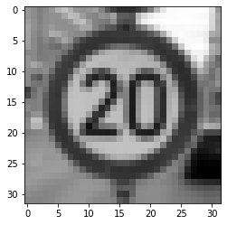
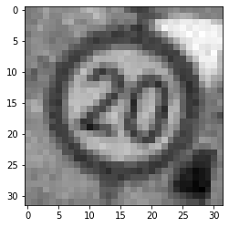
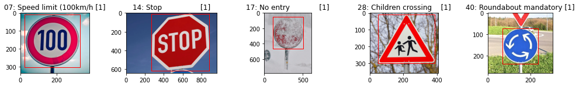
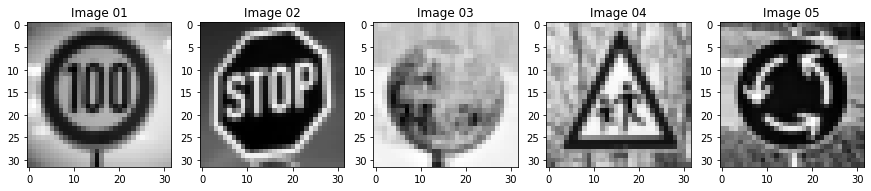

# Traffic Sign Recognition Program

In this project of the Udacity [Self-Driving Car NanoDegree](https://www.udacity.com/course/self-driving-car-engineer-nanodegree--nd013) program, I am implementing a Convolutional Neural Network (CNN) using [TensorFlow](https://www.tensorflow.org/) to classify traffic sign images using the [GTSRB (German Traffic Sign) Dataset](http://benchmark.ini.rub.de/?section=gtsrb&subsection=dataset).

**Build a Traffic Sign Recognition Project**

The goals / steps of this project are the following:
* Load the data set (see below for links to the project data set)
* Explore, summarize and visualize the data set
* Design, train and test a model architecture
* Use the model to make predictions on new images
* Analyze the softmax probabilities of the new images
* Summarize the results with a written report

## Resources

* [Self-Driving Car NanoDegree](https://www.udacity.com/course/self-driving-car-engineer-nanodegree--nd013) course description at Udacity.
* [Traffic Sign Classifier](https://github.com/udacity/CarND-Traffic-Sign-Classifier-Project) project template on Github.
* [German Traffic Sign Dataset](http://benchmark.ini.rub.de/?section=gtsrb&subsection=dataset)

## Summary

### Data Set Summary & Exploration

I used NumPy as well as some Pandas functionality to inspect the structure of the traffic sign image dataset. In cell 5 of the [Jupyter notebook](P3.ipynb), the following basic statistics are calculated:

* The size of training set is *34799*.
* The size of the validation set is *4410*.
* The size of test set is *12630*.
* The shape of a traffic sign image is *32x32x3* pixels in RGB.
* The number of unique classes/labels in the data set is *43*.

Using the provided [label map](signnames.csv) an overview of all available image classes is generated, with the title of each subplot showing the class label, corresponding title and number of samples in the combined dataset, together with an actual image: 

The red rectangles show the region of interest (ROI) provided along with each image in the dataset.

In a stacked bar chart the distribution of the dataset can be visualized. This chart shows the number of samples per label for training, validation and test data.

One can clearly see, that this dataset is imbalanced, with some classes having only a fraction of samples compared to others (ranging from 180 to 2010 samples). This can be a problem when training a neural network, leading to lower classification accuracy for images from undersampled classes. In the next section, a possible solution to this issue is discussed.

### Design and Test a Model Architecture

#### Pre-processing

In cell 6 of the notebook, an image preprocessing chain is implemented. Its main purpose is to normalize all image samples to become as unified as possible both in color and scale. For each sample of the dataset (including validation and testing) the following conversion steps are applied:

1. Conversion to grayscale.
Removing color information turned out to improve accuracy of the trained model. Looking at the varying levels of brightness in the dataset, color would not be a reliable feature anyway.

2. Cropping and rescaling to align region of interest.
Convolutional neural networks are invariant to translation in the image, but not to varying scale of features. Since ROIs for each traffic sign were provided as part of the dataset (plotted in red above), this information is used to crop the image before rescaling it to the target resolution expected by the CNN.

3. Normalization
In order to make samples from extreme lighting conditions more comparable and enable the CNN in its initial training phase to work with simple weights centered around zero, each individual image is normalized in its luminosity. This normalization takes into account the minimum and maximum luminosity of each image and rescales its pixel float values to a range in [-1.0, +1.0].
   

#### Augmentation and Balancing of the Training Data

Cell 7 of the notebook generates additional samples from the training part of the dataset. This measure serves 2 purposes. First, enriching the dataset with slightly modified images, exhibiting additional noise and moderate rotation. Second, remedy the dataset imbalance by performing 'oversampling' on the unbalanced classes.

The augmentation is performed class by class. For each class, an image is randomly selected from the training dataset:

The image is rotated by a random amount within [-15, +15] degree and a random amount of Gaussian noise with sigma = 0.01 is applied.

These steps are repeated, until for each class the data is augmented to total of *6030* samples evenly.

The augmented training dataset now contains *172860* samples, which is roughly *5 times* the original size.

### Convolutional Neural Network Architecture

The CNN model implemented in cell 8 and 9 of the notebook for this particular project is a tuned [LeNet-5](http://yann.lecun.com/exdb/lenet/) model.

*Source: Yan LeCun*

| Layer         		|     Description	        					| 
|:---------------------:|:---------------------------------------------:| 
| Input         		| 32x32x1 grayscale image   				    | 
| Convolution 5x5     	| 1x1 stride, valid padding, outputs 28x28x6 	|
| TanH					| Activation                					|
| Max pooling	      	| 2x2 stride, outputs 14x14x6   				|
| Convolution 5x5	    | 1x1 stride, valid padding, outputs 10x10x16	|
| TanH					| Activation                					|
| Max pooling	      	| 2x2 stride, outputs 5x5x16   		    		|
| Fully connected  		| Input layer (flatten), outputs 400  			|
| Dropout				| Regularization, dropout rate = 0.3			|
| Fully connected		| 1st fully connected layer, outputs 120		|
| TanH					| Activation                					|
| Dropout				| Regularization, dropout rate = 0.3			|
| Fully connected		| 2nd fully connected layer, outputs 84 		|
| TanH					| Activation                					|
| Dropout				| Regularization, dropout rate = 0.3			|
| Fully connected		| Output layer, outputs 43               		|
| Soft Max              | Prediction probabilities                      |
| Cross Entropy         | Loss function                                 |
| Adam Optimizer        | Stochastic gradient descent (adaptive)        |

A LeNet architecture appears to be a good fit for the task at hand: Dissect image input data into translation invariant feature maps, feeding those into a series of fully connected layers to predict the class labels. 

I started designing and training the model with the original unbalanced dataset, using a simplified version of the above scheme, without the dropout and using RELU instead of tanh activation.
In order to assess the stability of the trained model, I would plot the training and validation set accuracy over the number of epochs. While experimenting with the hyperparameters of the model, I aimed at a reasonable 'steep' learning curve and a high validation set accuracy, which should never start moving away from the training set accuracy - that would be an indicator of overfitting.

With the introduction of dropouts in the fully connected layers, overfitting was effectively avoided and did not pose a challenge during my optimization attempts. With a moderate dropout rate, the final validation accuracy seemed unaffected.

Replacing the 'RELU' activations with 'tanh' accelerated training, yielding slightly higher accuracies within less epochs. Presumably, with the input data properly normalized to values around zero and weights initialized accordingly, 'tanh' provides more favourable gradients compared to 'RELU' which is flat for negative values.

Weights are initialized with random numbers from a normal distribution with standard deviation `SIGMA` = 0.1 and mean `MU` = 0.0, truncated a 2 times the standard deviation.

Experiments with L2 regularization, effectively putting a penalty on weights in the fully connected layers, did not yield any improvements. The responsible hyperparameter `BETA` in the notebook is set to `0`, disabling L2 regularization.

Several modifications to the model with respect to the dimensionality of the hidden layers were attempted. Neither decreasing or increasing the dimensions and thus depth of feature layers and number of free parameters did improve the model. The latter seemed to lead to overfitting.

The preprocessing stage as well as the augmentation of the imbalanced training dataset resulted in a remarkable improvement of the model (both at least by 1% in accuracy each).

The remaining hyperparameters were iteratively optimized by hand, taking the training and validation accuracies as indicators for a stable model.

In the exported notebook [P3.html](assets/P3.html) the following hyperparameter settings were chosen:
* `LEARNING_RATE`: Initial learning rate for the optimizer of *0.001*
* `DROPOUT_RATE`: Probability for dropping inputs in dropout layers of *0.3*
* `BATCH_SIZE`: Batch size of *128*
* `EPOCHS`: Number of Epochs *100*

For this particular training run, the following accuracies were achieved: 
* Training set accuracy of *0.999*
* Validation set accuracy of *0.976* 
* Test set accuracy of **0.970**

With the test set accuracy remaining stable at the same value for several training runs and the training/validation accuracy showing little sign of overfitting, classification attempts on new images con be attempted with confidence.

The confusion matrix printed in cell 13 allows for a closer analysis of images classes causing the most issues - the row represent the labels, the columns the predictions. With the model properly tuned, no significant off-diagonal elements can be seen for the test set.

### Test the Model on New Images

For this test several German traffic signs were picked from the web.
The region of interest (red rectangle) was added by hand to allow the pre-processing stage to normalize and crop the input just as with the GTSRB dataset for training.

During the pre-processing stage, those test images were converted to grayscale, cropped and scaled so that their ROI lies within the target 32x32 pixel size.

Classifying these 5 new images with the trained model yields an accuracy of *80.0%*, with image 3 being the only one not correctly classified. This result is comparable with the accuracy of the German Traffic Sign test set, given that the snow-covered sign in image 5 is barely recognizable even for the human eye. 

The code for calculating the predictions for these images is located in cell 12 of the Ipython notebook.

For each image the top 5 prediction probabilities are listed and discussed below: 

#### Image 1 - [7] 120 km/h speed limit

| Probability   |     Prediction	        		| 
|:-------------:|:---------------------------------:| 
| .902         	| 7 - Speed limit 100 km/h			| 
| .084    		| 8 - Speed limit 120 km/h			|
| .008			| 2 - Speed limit  50 km/h			|
| .002	    	| 5 - Speed limit  80 km/h	 	    |
| .002		    | 3 - Speed limit  60 km/h	 	    |

For this image the consistent scaling/resizing in the pre-processing stage turned out to be crucial. Without it, the classifier would easily confuse the image with class 8 (speed limit 120 kmh).

#### Image 2 - [14] Stop

| Probability   |     Prediction	        		| 
|:-------------:|:---------------------------------:| 
| 1.000        	| 14 - Stop        					| 
|  .000     	| 15 - No vehicles					|
|  .000     	| 38 - Keep right					|
|  .000     	| 17 - No entry		 	            |
|  .000     	|  8 - Speed limit 120 km/h			|

#### Image 3 - [17] No Entry

| Probability   |     Prediction	        		| 
|:-------------:|:---------------------------------:| 
| .457      	| 22 - Bumpy road					| 
| .228     		|  4 - Speed limit 70 km/h			|
| .111			|  0 - Speed limit 20 km/h			|
| .071	    	| 17 - No entry 				 	|
| .020		    | 14 - Stop           				|

Not even the augmentation of the training set with generated noise was able to prevent a bad predicition with this particular test image. It seems that the classifier favors more complex features to match against the snowy pattern of the source image. The correct label is number 4 on the list of top 5 Softmax probabilities.

#### Image 4 - [28] Children Crossing

| Probability   |     Prediction	        		| 
|:-------------:|:---------------------------------:| 
| 1.000        	| 28 - Children crossing			| 
|  .000     	| 29 - Bicycles crossing			|
|  .000     	| 20 - Dangerous curve  			|
|  .000     	| 30 - Beware of ice/snow		 	|
|  .000     	| 22 - Bumpy road      				|

#### Image 5 - [40] Roundabout Mandatory

| Probability   |     Prediction	        		| 
|:-------------:|:---------------------------------:| 
| 1.000        	| 40 - Roundabout mandatory			| 
|  .000     	|  7 - Speed limit 100 km/h			|
|  .000     	| 12 - Priority road				|
|  .000     	| 16 - Vehicles over 3.5         	|
|  .000     	|  8 - Speed limit 120 km/h         |

This particular selection of test images shows, that the accuracy as a metric for a CNN model can only be properly interpreted with respect to the nature of the test set - including a possible imbalance, as seen with the GTSRB dataset.
Other metrics which could be considered in a further discussion, are the recall and precision for each class, giving indication to strengths and weaknesses of the model.

### Visualizing the Neural Network

Down below the output of the two convolutional layers of the used CNN is visualized, taking two of the new test set images as stimuli. The first layer produces a map highlighting features and contrast on the inside of the traffic sign while still representing the complete traffic sign as such. The second layer continues breaking down the full picture into smaller patterns found within the sign.

#### Image 1 - 100 km/h speed limit

#### Image 2 - stop sign

# Structure

* [README.md](README.md): this file.
* [P3.ipynb](P3.ipynb): The Jupiter notebook containing the commented implementation
* [signnames.csv](signnames.csv) CSV file containing a a table of traffic sign classes used in this project 
* [images/*](images): German traffic sign images found on the web for evaluating the trained model
* [assets](assets): Supplemental images for this README.md
* [.ipynb_checkpoints/*](.ipynb_checkpoints): Jupyter checkpoints for [P3.ipynb](P3.ipynb)

## Dependencies
The implementation of this project is based on the 'Conda' lab environment provided by Udacity:
* [CarND Term1 Starter Kit](https://github.com/udacity/CarND-Term1-Starter-Kit)

It uses TensorFlow v1, at least for the time being.

## License
The contents of this repository are covered under the [MIT License](https://github.com/mkleesiek/CarND-LaneLines-P1/blob/master/LICENSE)